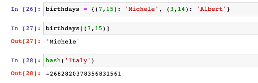

## Dictionaries and sets

Some notes from [chapter2/02_03_dicts.ipynb](../chapter2/02_03_dicts.ipynb)
### Dictionaries 
Lists are (primarily?) driven by position, dictionaries are key/value storage
> * While lists give us a way to retrieve values by their index. Python dictionary or dicts associate keys with values... 

Syntacially they look similar
> * Dicts are written with curly braces, separating items with commas and prefixing them by their key in a column. For instance, the capitals of a few countries. Just as we do with lists, values are accessed with a bracket notation. But instead of a number, we're going to use a key. 

One major difference is that it is much simpler to combine lists 
> * Combining two dictionaries requires a little more thought than combining two lists. Unlike lists, we cannot just use the plus to add them. That's because we need to specify what happens if both dictionaries define the same key. 

I wasn't aware of the internal hash table behind every dictionary

> What we then do is to update a dict using another, which will replace existing items as appropriate. This happens in place and modifies the dict. Similarly to lists, we can delete items by key. In fact, keys do not need to be strings. Any Python object that is hashable may be used as a name. Hashable means that Python can convert it to a number. 

Running a few simple tests it appears the hash algorithm is different hash values (`7478842987163339785` vs `-2682820378356831561`) i.e. at least between my python3 cli (v3.9.1) and my jupyter notebook (v3.9.12) 

```
>>> capitals = {'United States': 'Washington, DC', 'France': 'Paris', 'Italy': 'Rome'}
>>> morecapitals = {'Germany': 'Berlin', 'United Kingdom': 'London'}
>>> capitals + morecapitals
Traceback (most recent call last):
  File "<stdin>", line 1, in <module>
TypeError: unsupported operand type(s) for +: 'dict' and 'dict'
>>> capitals.update(morecapitals)
>>> hash('Italy')
7478842987163339785
>>> from platform import python_version
>>> print(python_version())
3.9.1
```


and via jupyter notebook i.e. [chapter2/02_03_dicts.ipynb](../chapter2/02_03_dicts.ipynb)





Next looping over keys, there are a few different options
* for key in dictionary
* dictionary.key returns 
```
>>> for country in capitals:
...     print(country)
... 
United States
France
Italy
Germany
United Kingdom
>>> capitals.keys()
dict_keys(['United States', 'France', 'Italy', 'Germany', 'United Kingdom'])
>>> list(capitals.keys())
['United States', 'France', 'Italy', 'Germany', 'United Kingdom']
```

> * The most straightforward syntax loops over the keys, for key in dictionary. Here, I'm using bold to denote language keywords. Whereas Roman words are the names of the variables that you will be using. You can loop also explicitly over the keys, you can loop over the values, and you can loop over the keys and values together. Let's see an example of each of these For country in capitals, we loop over keys. So will for country in capitals keys. 

> * Note that capitals dot keys is not a list, but a special iterator object. We can make it into a list though by feeding it to the list constructor list. The other two dict loops are over values, dot values, and over keys and values together using tuple unpacking. Beginning in Python 3.6 for the C Python interpreter, and in python 3.7, for the very language definition, the order of insertion is preserved for dicts. This means then when we loop over the keys or the items, we get them in the order in which we originally added them to the dict. That was not the case in previous versions of Python and in fact, the standard library defined a special object called order dict to preserve that order. 

### Sets
Sets are mixed collections and don't allow duplicate entries

```
>>> test_set={'one',2,3}
>>> print(test_set)
{2, 3, 'one'}
>>> test_set.add(2);
>>> print(test_set)
{2, 3, 'one'}
>>> test_set.remove(3);
>>> print(test_set)
{2, 'one'}
>>> type(test_set);
<class 'set'>
```

> You can think of them as bags of item, which can be of mixed types and which do not have duplications. For instance, the continents. Sets are written with braces, but without columns. You can see that Africa only appears once, even if we had it twice when we define the set. We can check if an item exists in a set. We can add items or remove them or loop over the set. but there's no way to do indexing. 

Lastly sets and dicts are apparently used heavily internally in python:

> Sets and especially dicts are very important in Python, since they underlie many aspects of the language itself. For instance, the methods and attributes of classes are stored internally in dicts, and a dict key based interface is also used in many third party packages, including pandas. So it's very good to become familiar with them.


I was wondering about the relationship between `dict_keys` and `sets`

```
>>> type(capitals);
<class 'dict'>
>>> type(capitals.keys());
<class 'dict_keys'>
```


