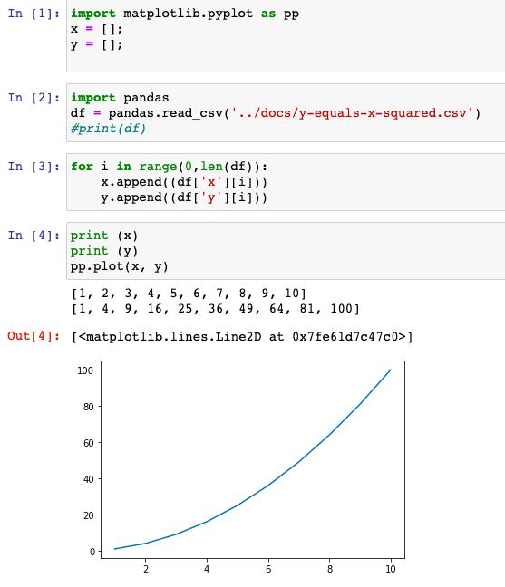

## Feeding a csv files into matplotlib.lines.Line2D

Following on from []()
* take the input from a `.csv` file
* use `pandas` to split this table into two equal lenght lists (x,y) 
* feed our x[] and y[] lists into matplotlib.lines.Line2D - for another simple plot example

I've created [feeding-csv-matplotlib.lines.Line2D.ipynb](../chapter2/feeding-csv-matplotlib.lines.Line2D.ipynb)



here is our `.csv` input

```
~/projects/Python_Data_Analysis $ cat docs/y-equals-x-squared.csv 
x,y
1,1
2,4
3,9
4,16
5,25
6,36
7,49
8,64
9,81
10,100
```