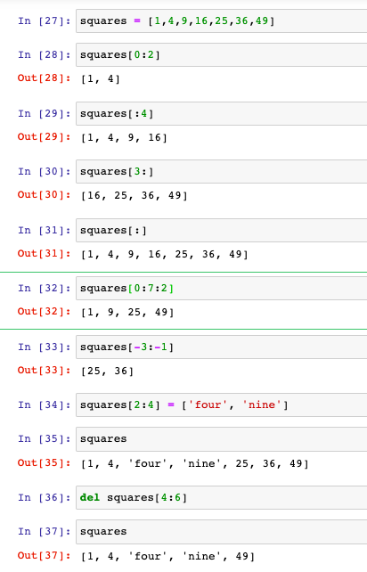
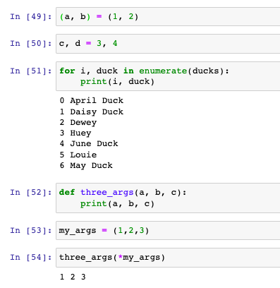

## Lists, tuples, and the slicing syntax

Following [02_02_sequences.ipynb](../chapter2/02_02_sequences.ipynb) and highlightling some of the more interesting details here...

I knew Python used "zero based indexing", but didn't explicitly connect this to it C hertiage

> This convention of starting from zero comes from C, the language that inspired Python and that was used to write the standard Python interpreter known as CPython.

I've already used the append method 

> To add a single element at the end of the list, we use append. You see that here we are using Python in an object-oriented way. By accessing the method, specifically append, of the list object. It's so easy that we barely notice it. 

I'm less familiar with extend

> To add multiple elements in one go, we can use extend. 

and concatenate two lists, with a plus feels kinda obvious:

> To concatenate two lists, we use a plus. That's an example of operator overloading in Python where plus does different things for numbers and for lists. 

Last, we can insert elements at any position in a list using the insert method. 

How about removing elements? We can delete them based on their index with `del` or based on the value with `remove`.

```
del ducks[0]                  << removes the 1st item       (which happens to be 'Scrooge McDuck')
ducks.remove('Donald Duck')   << removes item 'Donald Duck' (which happens to be 7th out of 8th)
```

Sorting is kinda obvious, although I've not used the `reverse=True` in python before
```
ducks.sort()
reverse_ducks = sorted(ducks, reverse=True)
```

The slicing is where it gets more interesting:
> There are a few more tricks that we can use in slicing. For instance we can omit the starting index to start at the beginning, omit the ending index to include elements to the end. Omit both, to get a copy of the list. Move through the indices in steps. And even use negative indices to count from the end. Slices can also be used to reassign a subset of items or to delete them. When we introduce NumPy arrays in chapter four, we will see that this basic slicing syntax carries over. 



As a postgres DBA, I'm very familiar with the concept of `immutable tuples` (and associated dead row / vacuum headaches):

> * Now for tuples, which look like lists but with parentheses instead of brackets. They are sometimes described as immutable versions of lists. We can do the same indexing and slicing tricks, but we cannot modify the elements or add new ones. One context in which one sees tuples often is tuple unpacking, where Python statements or expressions are automatically evaluated in parallel over a tuple. For instance, to assign multiple variables at once. The parentheses can even be omitted when there is no room for ambiguity. 
> * Tuples appear also when we iterate over multiple variables at once. For example using the enumerate iterator on a list. Which lets us loop over list index and list element together. 
> * We can also unpack a tuple to pass it to a function that requires multiple arguments such as three args. It takes a tuple if we prefix it with an asterisk. 

